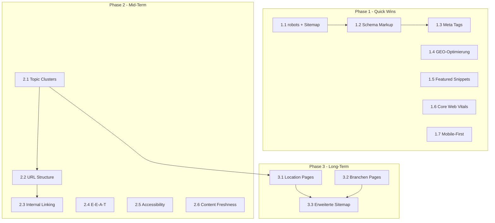

# SEO/GEO Tasklisten – Index

**Projekt:** Berneby Solutions Website  
**Basis:** [IMPLEMENTATIONSPLAN_SEO_GEO.md](IMPLEMENTATIONSPLAN_SEO_GEO.md)  
**Erstellt:** 13. Februar 2026

---

## Übersicht

Dieser Index verweist auf die phasenspezifischen Tasklisten für die SEO/GEO-Implementierung. Alle Tasks sind an den bestehenden Code-Space in `berneby-website/` angepasst.

| Phase | Dokument | Maßnahmen | Zeitraum |
|-------|----------|-----------|----------|
| 1 | [TASKLIST_PHASE_1_QUICK_WINS.md](TASKLIST_PHASE_1_QUICK_WINS.md) | 7 (1.1–1.7) | 0–4 Wochen |
| 2 | [TASKLIST_PHASE_2_MID_TERM.md](TASKLIST_PHASE_2_MID_TERM.md) | 6 (2.1–2.6) | 2–6 Monate |
| 3 | [TASKLIST_PHASE_3_LONG_TERM.md](TASKLIST_PHASE_3_LONG_TERM.md) | 3 (3.1–3.3) | 6–12 Monate |

---

## Abhängigkeiten

---

## Reihenfolge (empfohlen)

### Phase 1 (Sofort starten)
1. 1.1 robots.txt & Sitemap
2. 1.2 Schema Markup
3. 1.3 Meta Tags
4. 1.4 GEO-Optimierung
5. 1.5 Featured Snippets
6. 1.6 Core Web Vitals
7. 1.7 Mobile-First Audit

### Phase 2 (nach Phase 1)
1. 2.1 Topic Clusters & Pillar Pages
2. 2.2 URL Structure
3. 2.3 Internal Linking
4. 2.4 E-E-A-T
5. 2.5 Accessibility
6. 2.6 Content Freshness

### Phase 3 (nach Phase 2)
1. 3.1 Location Pages
2. 3.2 Branchen Pages
3. 3.3 Erweiterte Sitemap

---

## Code-Space Referenz

| Bereich | Pfad | Status |
|---------|------|--------|
| App Root | `berneby-website/app/` | Bestehend |
| Marketing Pages | `app/(marketing)/page.tsx`, `handwerk/`, `tech/`, `kontakt/` | Bestehend |
| Legal | `app/(marketing)/legal/datenschutz/`, `legal/impressum/` | Bestehend – URLs sind `/legal/datenschutz`, `/legal/impressum`; Footer verlinkt auf `/impressum`, `/datenschutz` → Prüfen |
| Über uns | `app/ueber-uns/page.tsx` | Bestehend |
| Constants | `lib/constants.ts` | Bestehend (PAGE_META, FAQ_ITEMS, CRAFT_PACKAGES, etc.) |
| Schema | `lib/seo/schema.ts` | **Neu** (Phase 1) |
| Content | `lib/content/ratgeber.ts` | **Neu** (Phase 2) |
| Data | `lib/data/locations.ts`, `lib/data/branchen.ts` | **Neu** (Phase 3) |

---

## Process-Systemprompt

Für die Umsetzung durch KI-Agenten (z.B. Cursor) dient [PROCESS_SYSTEMPROMPT_SEO_GEO.md](PROCESS_SYSTEMPROMPT_SEO_GEO.md) als Rahmenvorgabe.
